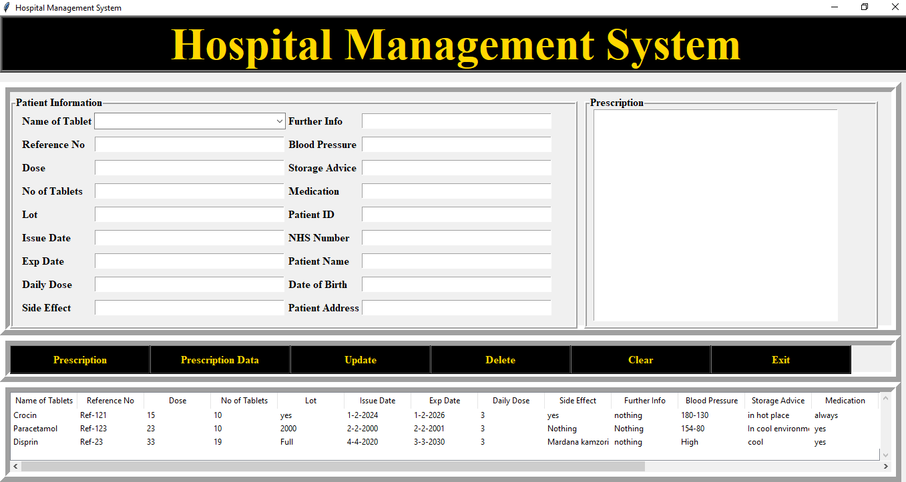

# 🏥 Hospital Management System


A comprehensive **Desktop Application** built with **Python (Tkinter)** and **MySQL** to manage hospital records, patient prescriptions, and medical history efficiently.

---

## 📸 Interface Screenshots

| **Dashboard View**


---

## ✨ Key Features

* ✅ **Patient Registration:** Store patient details like Name, Address, DOB, and NHS Number.
* ✅ **Prescription Management:** Assign medicines, dosage, and side effects.
* ✅ **Database Integration:** All records are securely stored in a MySQL database.
* ✅ **CRUD Operations:**
    * **C**reate (Add new records)
    * **R**ead (View records in a Treeview table)
    * **U**pdate (Modify existing patient details)
    * **D**elete (Remove records)
* ✅ **Search & Filter:** Easily find patients by Reference No.

---

## 🛠️ Tech Stack

* **Frontend:** Python Tkinter (Standard GUI Library)
* **Backend:** MySQL Database (XAMPP / WAMP / MySQL Workbench)
* **Connector:** `mysql-connector-python`

---

## ⚙️ Prerequisites

Before running the project, make sure you have the following installed:

1.  **Python 3.10+** ([Download Here](https://www.python.org/downloads/))
2.  **MySQL Server** (via [XAMPP](https://www.apachefriends.org/) or [MySQL Workbench](https://dev.mysql.com/downloads/workbench/))
3.  **Git** (Optional, for cloning)

---

## 🚀 Installation & Setup

Follow these steps to get the project running on your local machine.

### 1. Clone the Repository
Open your terminal (Command Prompt / Git Bash) and run:

```bash
git clone [https://github.com/your-username/hospital-management-system.git](https://github.com/your-username/hospital-management-system.git)
cd hospital-management-system